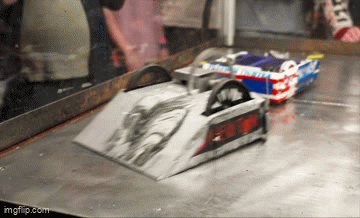
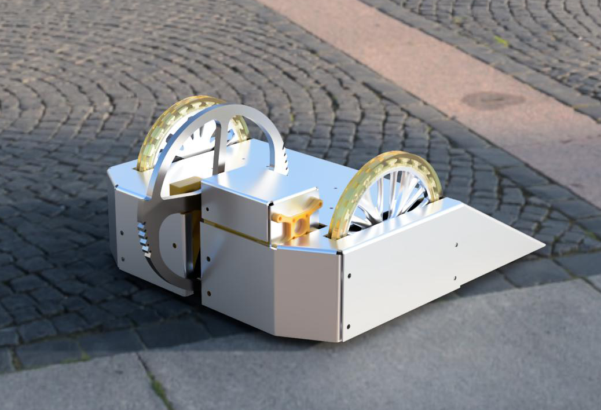
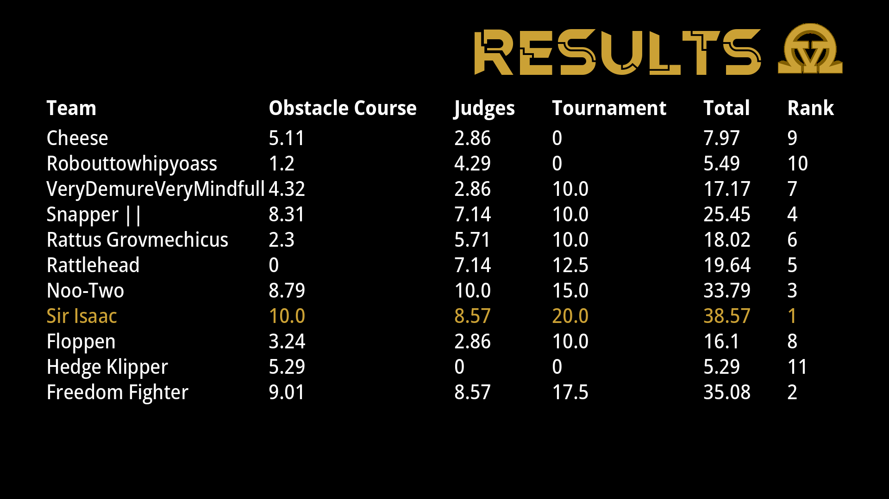
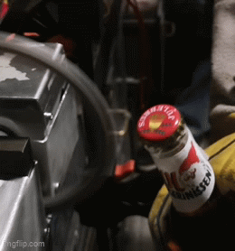

# NRK Newton Robot: Sir Isaac

> Collaborators: Svein Isdahl, Eivind Møen, Jørgen Knoph, Tord Natlandsmyr

This repository contains the project files for the NRK Newton Robowars ("Robotkrig") robot, Sir Isaac, fall 2024.

Link to NRK Newton episode: https://tv.nrk.no/serie/newton/sesong/2025/episode/DMPP21500625

## Background

Early fall 2024 we were contacted regarding the possibility of a kid's science show, NRK Newton, participating Robowars ("Robotkrig") at our local hackerspace, [Omega Verksted](https://omegav.no). We quickly gathered a crack team of friends all studying Cybernetics and Robotics at NTNU to design and manufacture a robot that could crush the competition at a budget of 6000-7000 NOK in about two months. 

## Concept

The robot is based on a wedge-shaped chassis and a bi-directional vertical spinner. We wanted to make a robot that could both flip the opponents and do substantial damage to the obstacle course, which both accounted for 50% of the final score. We wanted to design and CNC manufacture the weapon based on simulations in Fusion 360. We wanted to make the design as simple as possible using off-the-shelf parts and 3D-printing where possible. One weakness of this concept was choosing a vertical spinner instead of a horizontal spinner, since this gave us a disadvantage at the obstacle course, where we were judge by the damage we could do to some soda cans and the time it took to do it. 

## Design

## Results

| Obstacle course (10 max) | Judges (10 max)| Tournament (20 max)| Total (40 max) | Rank |
| ---- | ---- | ---- | ----     | ---                               |
|10.0 | 8.57 | 20 | 38.57 | 1 |

As you might see, it went quite well, but not without struggles. Thanks to all the participants for making it an interesting fight!

## That's all, folks!

Most of the design files, code and budget is listed in this repository, allthough some last minute changes did occur. 

